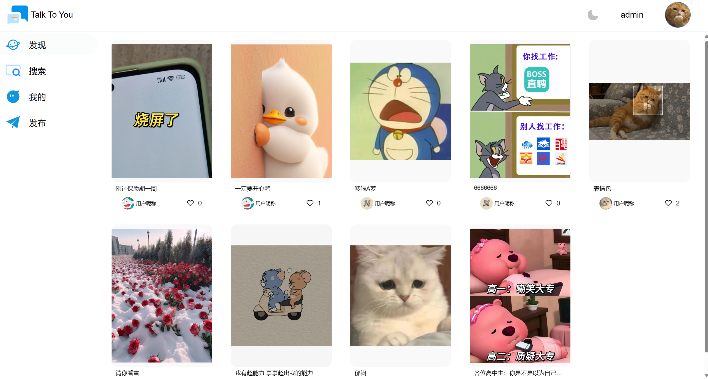
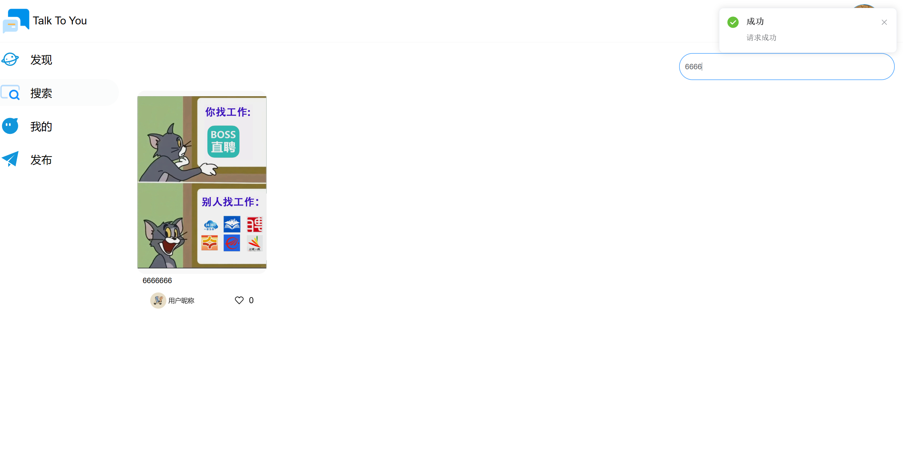
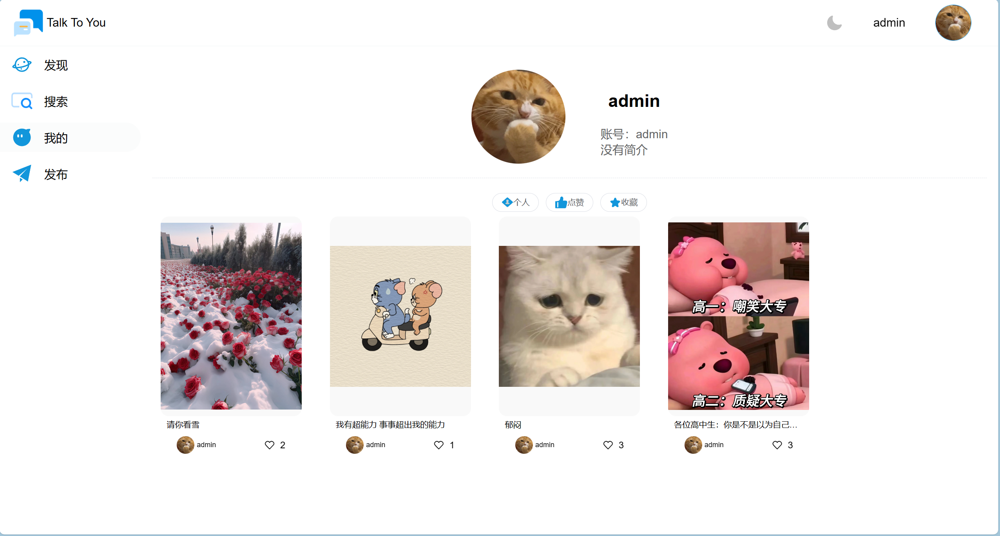
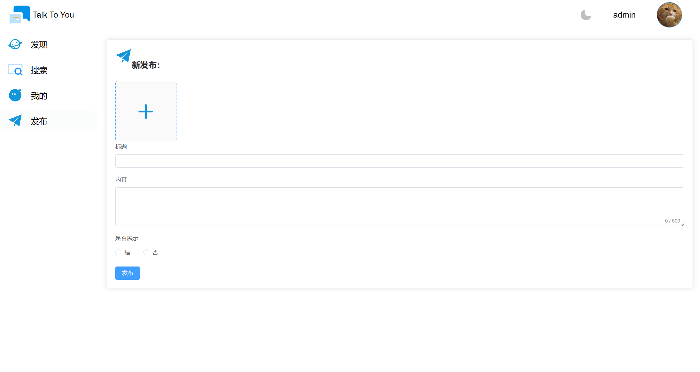
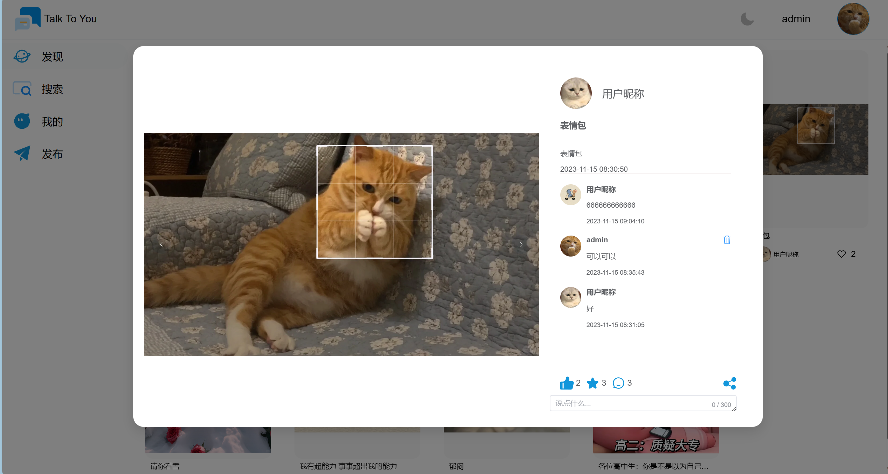
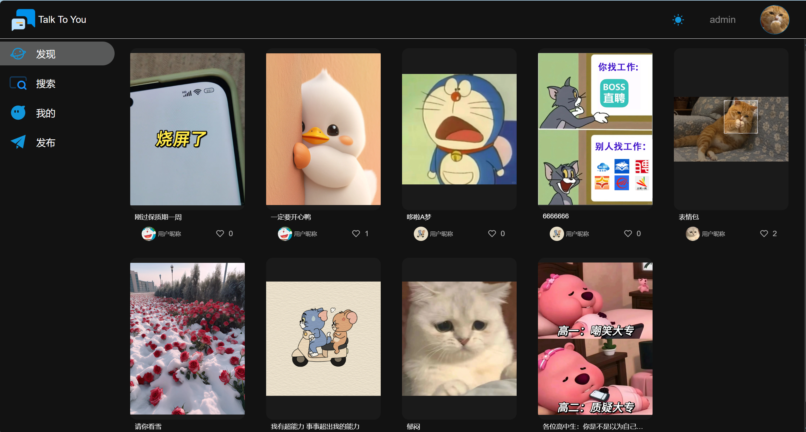
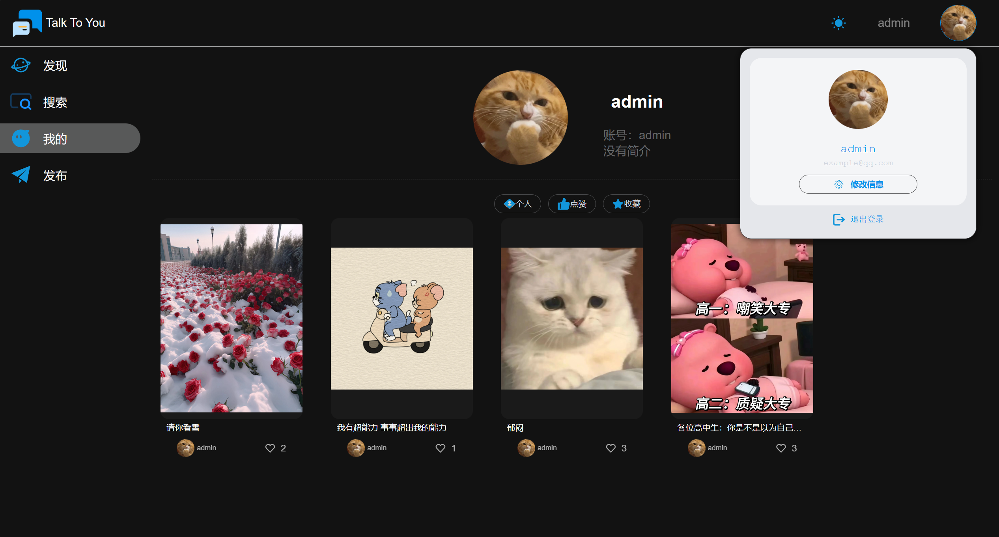
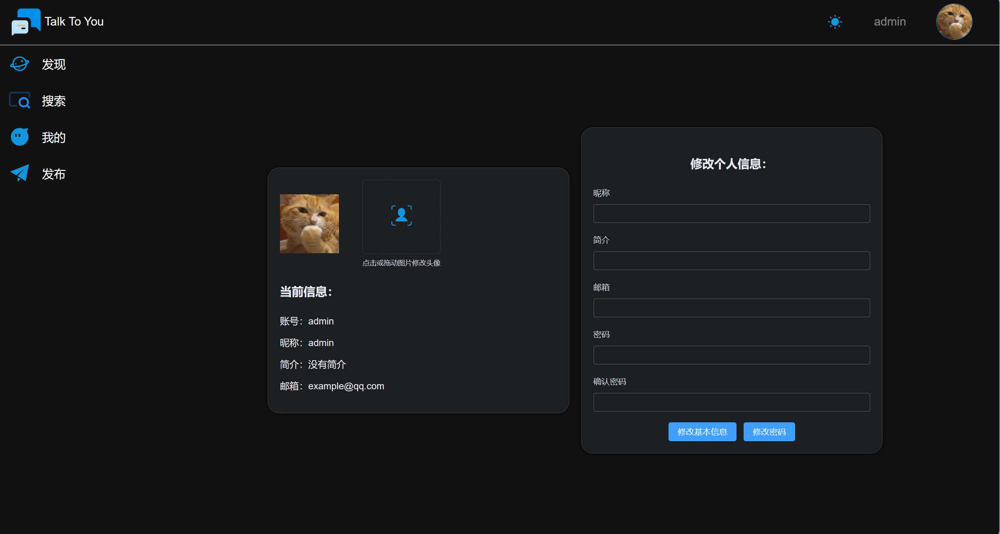

# *Talk To You*

-   *默认用户名：admin*
-   *默认密码：admin*

### *一，[推荐]使用docker compose运行项目*

```shell
# 克隆到本地
git clone https://github.com/ataobiu/talk_to_you.git --depth 1 && cd talk_to_you/docker && cp ../db/talk_to_you.sql .
 
# 下载最新版本打包好的文件
wget https://github.com/ataobiu/talk_to_you/releases/latest/download/web.zip
wget https://github.com/ataobiu/talk_to_you/releases/latest/download/server.jar

# 下载基础镜像
docker pull mysql:8.1.0 && docker pull nginx:1.25.3 && docker pull openjdk:17

# 构建自己的镜像
docker build -t talktoyou_mysql -f mysql_Dockerfile .
docker build -t talktoyou_frontend -f frontend_Dockerfile .
docker build -t talktoyou_server -f server_Dockerfile .

# 随便找个目录部署项目，并复制docker-compose.yml,然后执行
docker compose up -d
```

### *二，直接部署*

##### *springboot*

*1.修改相应文件[application.yml](server/src/main/resources/application.yml)*

*2.构建*运行

```shell
cd server && mvn dependency:go-offline && mvn package -DskipTests=true
```

*3.运行jar文件*

```
java -jar talk_to_you.jar
```

##### *vue*

*1.修改文件[index.js](web/src/request/index.ts)中的baseURL，改成后端地址*

*2.构建*运行

```shell
pnpm install
pnpm run build
```

### *三，案例*
















